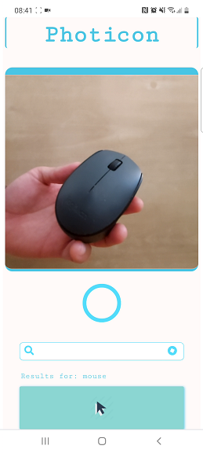

# photoicon - [DEMO](https://pavelsjo.github.io/photicon/)

Object detection from pictures to text using tensorflow js to look for icons using tensorflow js.

This is an experimental icon finder based on object detection using tensorflow JS, the approach is very simple, you need take a picture from camera and converted to tensor for prediccion.

The model is based in imagenet-inception_v3 and return 1000+ objects [labels](labels.js).

Those labels was used to looking for icons using api.

## Limitations

The number of possible icons is limited to the number of labels in imagenet.
